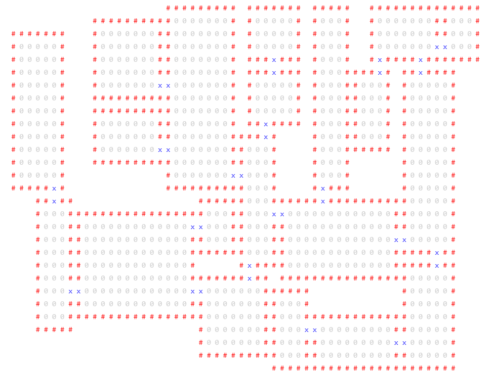

# Dungeon

TODO: docs



```js
const dungeon = new Dungeon({
  width: 50,
  height: 50,
  doorPadding: 1, // Experimental, minimum number of tiles between a door and a room corner (>= 1)
  randomSeed: 0, // Leave undefined if you don't want to control the seed
  rooms: {
    width: {
      min: 5,
      max: 10,
      onlyOdd: true // Or onlyEven: true
    },
    height: {
      min: 8,
      max: 20,
      onlyOdd: true // Or onlyEven: true
    },
    maxArea: 150,
    maxRooms: 50
  }
});

dungeon.drawToConsole({
  empty: " ",
  emptyColor: "rgb(0, 0, 0)",
  wall: "#",
  wallColor: "rgb(255, 0, 0)",
  floor: "0",
  floorColor: "rgb(210, 210, 210)",
  door: "x",
  doorColor: "rgb(0, 0, 255)",
  fontSize: "15px"
});

const html = dungeon.drawToHtml({
  empty: " ",
  emptyColor: "rgb(0, 0, 0)",
  wall: "#",
  wallColor: "rgb(255, 0, 0)",
  floor: "0",
  floorColor: "rgb(210, 210, 210)",
  door: "x",
  doorColor: "rgb(0, 0, 255)"
});
document.body.appendChild(html);

dungeon.rooms; // Array of Room instances
dungeon.tiles; // 2D array of tile IDs - see Tile.js for types

// Get a 2D array of tiles where each tile type is remapped to a custom value. Useful if you are
// using this in a tilemap, or if you want to map the tiles to something else, e.g. this is used
// internally to convert a dungeon to an HTML string.
var mappedTiles = dungeon.getMappedTiles({
  empty: 0,
  floor: 1,
  door: 2,
  wall: 3
});
```
