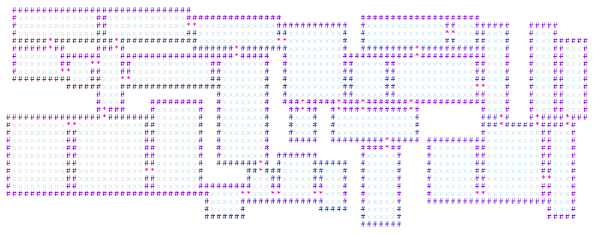

# Dungeon




## Installation

### As a Script

Grab the [minified js](https://github.com/mikewesthad/dungeon/releases/latest/download/dungeon.min.js) file & optional source [map](https://github.com/mikewesthad/dungeon/releases/latest/download/dungeon.min.js.map) (or the [unminified js](https://github.com/mikewesthad/dungeon/releases/latest/download/dungeon.js) file & optional source [map](https://github.com/mikewesthad/dungeon/releases/latest/download/dungeon.js.map)).

```html
<script src="dungeon.min.js"></script>
```

Or use the jsdelivr CDN:

```html
<script src="//cdn.jsdelivr.net/npm/@mikewesthad/dungeon@1.2.1"></script>
```

This will give you a `Dungeon` global variable.

### As a Module

```
npm i @mikewesthad/dungeon
```

```js
import Dungeon from "@mikewesthad/dungeon";
```

## Usage

See the examples folder for [a JavaScript example](./examples/javascript/) and [a TypeScript example](./examples/typescript/).

```js
const dungeon = new Dungeon({
  width: 50,
  height: 50,
  doorPadding: 1, // Experimental, minimum number of tiles between a door and a room corner (>= 1)
  randomSeed: "hello", // Leave undefined if you don't want to control the seed
  rooms: {
    width: {
      min: 5,
      max: 10,
      onlyOdd: true // Or onlyEven: true
    },
    height: {
      min: 8,
      max: 20,
      onlyOdd: true // Or onlyEven: true
    },
    maxArea: 150,
    maxRooms: 50
  }
});

// Make sure you resize your console (see guide that gets printed out in the console)
dungeon.drawToConsole({
  empty: " ",
  emptyColor: "rgb(0, 0, 0)",
  wall: "#",
  wallColor: "rgb(255, 0, 0)",
  floor: "0",
  floorColor: "rgb(210, 210, 210)",
  door: "x",
  doorColor: "rgb(0, 0, 255)",
  fontSize: "8px"
});

// Helper method for debugging by dumping the map into an HTML fragment (<pre><table>)
const html = dungeon.drawToHtml({
  empty: " ",
  emptyAttributes: { class: "dungeon__empty", style: "color: rgb(0, 0, 0)" },
  wall: "#",
  wallAttributes: { class: "dungeon__wall", style: "color: rgb(255, 0, 0)" },
  floor: "0",
  floorAttributes: { class: "dungeon__floor", style: "color: rgb(210, 210, 210)" },
  door: "x",
  doorAttributes: { class: "dungeon__door", style: "color: rgb(0, 0, 255)" },
  containerAttributes: { class: "dungeon", style: "font-size: 15px" }
});
document.body.appendChild(html);

dungeon.rooms; // Array of Room instances
dungeon.tiles; // 2D array of tile IDs - see Tile.js for types

// Get a 2D array of tiles where each tile type is remapped to a custom value. Useful if you are
// using this in a tilemap, or if you want to map the tiles to something else, e.g. this is used
// internally to convert a dungeon to an HTML string.
var mappedTiles = dungeon.getMappedTiles({
  empty: 0,
  floor: 1,
  door: 2,
  wall: 3
});
```

## Docs

See the web docs for the API [here](https://mikewesthad.github.com/dungeon/). The most useful page is the [Dungeon class](https://mikewesthad.github.com/dungeon/classes/_dungeon_.dungeon.html)

## Changelog

- 2.0.0
  - Rewrite in Typescript. API changes requiring more of the DungeonConfig to be specified in the constructor.

## Contributors

- [@mktcode](https://github.com/mktcode) - fix filename case. 
- [@gobah](https://github.com/gobah) - PR for getting the library working on node.
- And, of course, [@nickgravelyn](https://github.com/nickgravelyn/dungeon) who wrote the library that this fork is based on.
